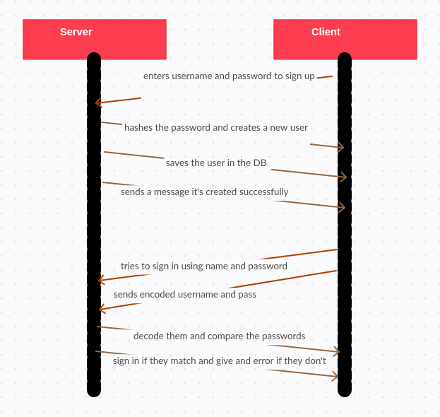

# basic-auth

instructor notes: in signup we need to hash the password and then create a new user and save it as a hashed password. in sign in we need to decode the username and password first and then find the user in our database and compare the hashed password with the input one so they can sign in

pull request: https://github.com/nour-alsatari/basic-auth/pull/1
 
heroku: https://basic-auth-nour-ltuc.herokuapp.com/
 
UML: 
